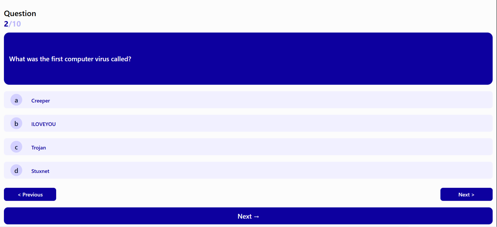
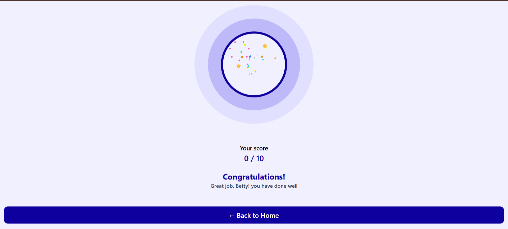

## Overview

Title:- Knowbit (Quiz App)
Description:- A Responsive Quiz taking app showing quiz result.

Project Link: https://knowbitquizapp.netlify.app/

## Folder Structure

src/
├── pages/
│ ├── Home.jsx # Home page
│ ├── Quiz.jsx # Question and logic
│ └── Result.jsx # Showing result
│
├── App.jsx # Main app component
└── Main.jsx # Entry point

## Features

- Interactive quiz with multiple pages (Home, Quiz, Result)
- Score tracking and result display
- Responsive design for all devices
- Clean UI built with React components
- Dynamic rendering of questions and answers
- Question Navigation – Next/Previous buttons

## Built With

- **React** – Frontend library for building UI
- **Vite** – Fast build tool and development server
- **JavaScript (ES6+)** – Logic and interactivity
- **CSS / Tailwind CSS** – Styling and responsiveness
- **React Router** – For navigation between pages (Home, Quiz, Result)
- **Lottie React** - for Animations

## ScreenShort

 - Home page UI
 - Quiz page UI
 - Result page UI

## Credits

- Favicon: [Quiz icons created by Freepik - Flaticon](https://www.flaticon.com/free-icons/quiz)
